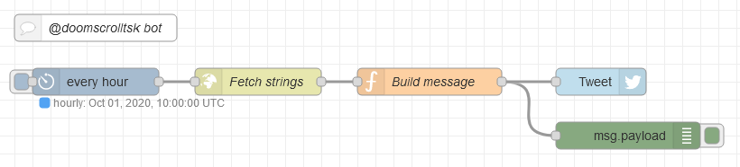

# @doomscrolltsk bot sources

These are the sources of [@doomscrolltsk](https://twitter.com/doomscrolltsk) on Twitter and [@doomscrolltsk@botsin.space](https://botsin.space/@doomscrolltsk) on Mastodon. It's 
implemented via a [NodeRED](https://nodered.org/) flow that utilizes the [node-red-node-twitter](https://flows.nodered.org/node/node-red-node-twitter) 
and [node-red-contrib-cron-plus](https://flows.nodered.org/node/node-red-contrib-cron-plus) nodes in 
addition to the built-in ones.

The messages it sends consist of two parts, one doomscroll heads-up and a suggestion what else to do.
The flow picks a random one from each and combines them into the final message, making sure it doesn't exceed 
the 280 character limit.

To allow for community contributions, the messages are stored in an external json file here on 
Github that gets pulled in by the flow.

The bot originated from a [tweet by @BillieRubenMake](https://twitter.com/BillieRubenMake/status/1311190649404706818)
asking for a bot to regularly inject doomscroll reminders into her timeline.

## Contributing strings

If you have ideas for new strings, be it doomscroll heads-ups or suggestions, add them to `messages.json`
and send me a [PR](https://help.github.com/articles/about-pull-requests)!

Messages should be light hearted. Doomscroll heads-ups may be a bit tongue in cheek, suggestions should
be wholesome.

## NodeRED flow

For the sake of completeness, this is the used NodeRED flow:



- "every hour": Cronplus node triggering once per hour
- "Fetch strings": Fetches the message parts from `https://raw.githubusercontent.com/foosel/doomscrollbot/master/messages.json`
- "Build message": Builds up the message, ensuring a minimum amount of repetition:
  ``` js
  var messages = msg.payload.doomscroll;
  var suggestions = msg.payload.suggestions;
  
  if (!messages || !suggestions) {
      node.error("No messages or suggestions found", msg);
      return;
  }
  
  var lastMessage = flow.get("lastMessage");
  var lastSuggestion = flow.get("lastSuggestion");
  var message = lastMessage;
  var suggestion = lastSuggestion;
  var tweet = "";
  while (message == lastMessage || suggestion == lastSuggestion || tweet.length > 280) {
      message = messages[Math.floor(Math.random() * messages.length)];
      suggestion = suggestions[Math.floor(Math.random() * suggestions.length)];
      tweet = message + "\n\n" + suggestion;
  }
  flow.set("lastMessage", message);
  flow.set("lastSuggestion", suggestion);
  
  return {
      payload: tweet
  }
  ```
- "prepare toot": Prepares the toot for the Mastodon portion, making sure the visibility is set to unlisted:
  ``` js
  return {
      payload: {
          status: msg.payload,
          visibility: "unlisted",
      }
  }
  ```
- "Tweet": Twitter node posting to [@doomscrolltsk](https://twitter.com/doomscrolltsk)
- "Toot": HTTP Request node, `POST`ing to `https://botsin.space/api/v1/statuses` with authorization type `Bearer`, using the "Access Token" from the Developer settings of the Mastodon account.


## License

[MIT](LICENSE.md)
