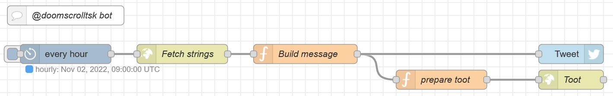

# @doomscrolltsk bot sources

These are the sources of the [@doomscrolltsk bot](https://twitter.com/doomscrolltsk) on Twitter. It's 
implemented via a [NodeRED](https://nodered.org/) flow that utilizes the [node-red-node-twitter](https://flows.nodered.org/node/node-red-node-twitter) 
and [node-red-contrib-cron-plus](https://flows.nodered.org/node/node-red-contrib-cron-plus) nodes in 
addition to the built-in ones.

The messages it sends consist of two parts, one doomscroll heads-up and a suggestion what else to do.
The flow picks a random one from each and combines them into the final message, making sure it doesn't exceed 
the 280 character limit.

To allow for community contributions, the messages are stored in an external json file here on 
Github that gets pulled in by the flow.

The bot originated from a [tweet by @BillieRubenMake](https://twitter.com/BillieRubenMake/status/1311190649404706818)
asking for a bot to regularly inject doomscroll reminders into her timeline.

## Contributing strings

If you have ideas for new strings, be it doomscroll heads-ups or suggestions, add them to `messages.json`
and send me a [PR](https://help.github.com/articles/about-pull-requests)!

Messages should be light hearted. Doomscroll heads-ups may be a bit tongue in cheek, suggestions should
be wholesome.

## NodeRED flow

For the sake of completeness, this is the used NodeRED flow:



``` json
[{"id":"15ffe8f5.329ef7","type":"twitter out","z":"8357254d.c82348","twitter":"","name":"Tweet","x":690,"y":620,"wires":[]},{"id":"8b9ed4fc.1fba3","type":"cronplus","z":"8357254d.c82348","name":"every hour","outputField":"payload","timeZone":"","persistDynamic":false,"commandResponseMsgOutput":"output1","outputs":1,"options":[{"name":"hourly","topic":"hourly","payloadType":"default","payload":"","expressionType":"cron","expression":"0 * * * *","location":"","offset":"0","solarType":"all","solarEvents":"sunrise,sunset"}],"x":130,"y":620,"wires":[["c4e146d0.4ba55"]]},{"id":"cc3c477c.8da868","type":"debug","z":"8357254d.c82348","name":"","active":true,"tosidebar":true,"console":false,"tostatus":false,"complete":"false","statusVal":"","statusType":"auto","x":720,"y":680,"wires":[]},{"id":"59e506e5.cb55d","type":"comment","z":"8357254d.c82348","name":"@doomscrolltsk bot","info":"","x":130,"y":560,"wires":[]},{"id":"c4e146d0.4ba55","type":"http request","z":"8357254d.c82348","name":"Fetch strings","method":"GET","ret":"obj","paytoqs":"ignore","url":"https://raw.githubusercontent.com/foosel/doomscrollbot/master/messages.json","tls":"","persist":false,"proxy":"","authType":"","x":310,"y":620,"wires":[["ad4181ea.32bc18"]]},{"id":"ad4181ea.32bc18","type":"function","z":"8357254d.c82348","name":"Build message","func":"var messages = msg.payload.doomscroll;\nvar suggestions = msg.payload.suggestions;\n\nif (!messages || !suggestions) {\n    node.error(\"No messages or suggestions found\", msg);\n    return;\n}\n\nvar lastMessage = flow.get(\"lastMessage\");\nvar lastSuggestion = flow.get(\"lastSuggestion\");\nvar message = lastMessage;\nvar suggestion = lastSuggestion;\nvar tweet = \"\";\nwhile (message == lastMessage || suggestion == lastSuggestion || tweet.length > 280) {\n    message = messages[Math.floor(Math.random() * messages.length)];\n    suggestion = suggestions[Math.floor(Math.random() * suggestions.length)];\n    tweet = message + \"\\n\\n\" + suggestion;\n}\nflow.set(\"lastMessage\", message);\nflow.set(\"lastSuggestion\", suggestion);\n\nreturn {\n    payload: tweet\n}","outputs":1,"noerr":0,"initialize":"","finalize":"","x":500,"y":620,"wires":[["cc3c477c.8da868","15ffe8f5.329ef7"]]}]
```

## License

[MIT](LICENSE.md)
